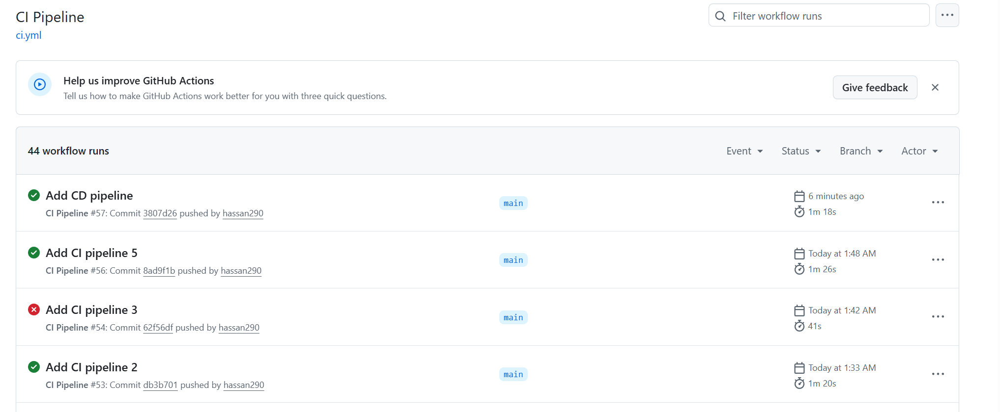
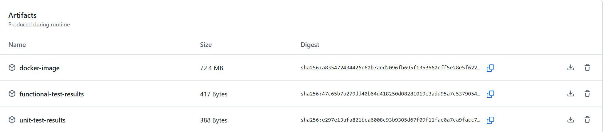
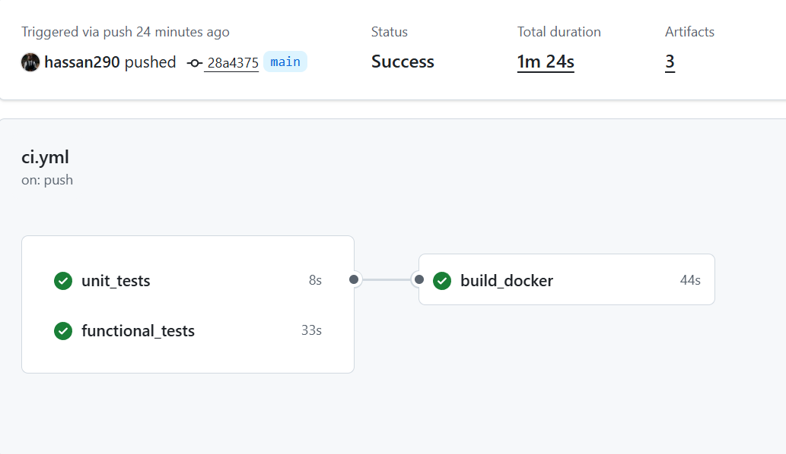
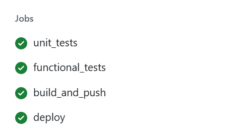
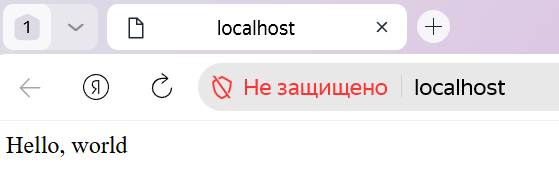
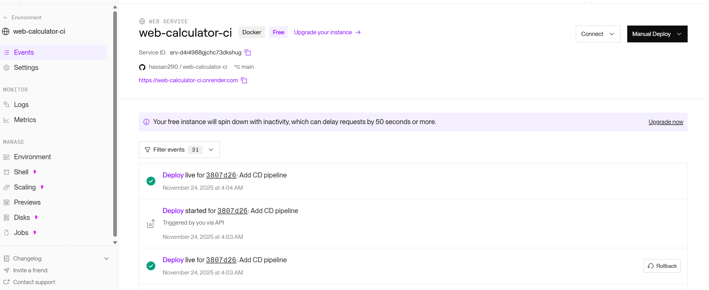
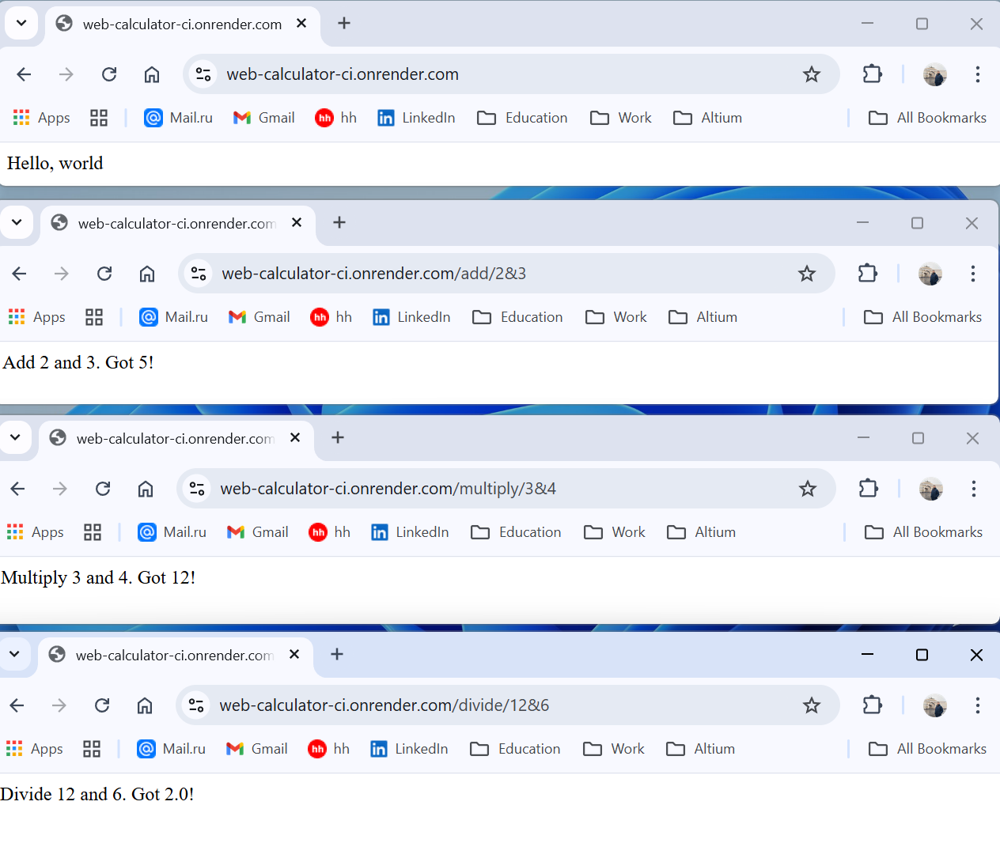
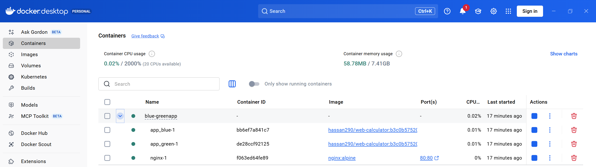
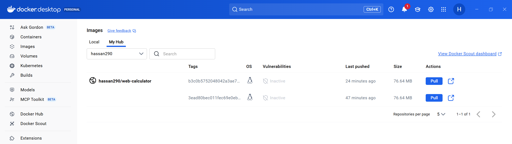

# CI/CD Pipeline Project

## 🚀 Task 1: CI Pipeline - COMPLETED ✅

### Features Implemented:
- ✅ Unit Tests (pytest)
- ✅ Functional Tests (Selenium) 
- ✅ Docker Image Building
- ✅ Artifacts Storage
- ✅ Docker Hub Integration

### Proof of Completion:

**Results:**

**CI Pipeline:**

**Generated Artifacts:**

**Tests Results:**

## 🎯 Task 2: CD Pipeline - Blue-Green Deployment ✅

### Features Implemented:

- ✅ Two application instances (blue + green)
- ✅ Nginx Reverse Proxy
- ✅ Health Checks
- ✅ Docker Compose infrastructure

### Proof of Completion:
**Running Application:**

**Server:**

**Testing:**

**Docker Container:**

**Docker Image:**
